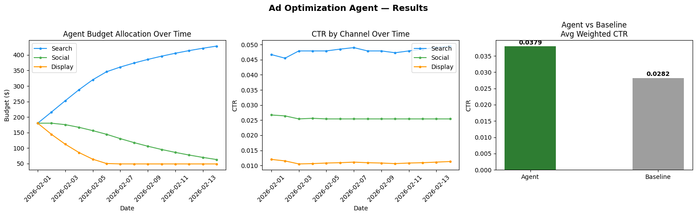

# Ad Optimization Agent

## Overview
An AI-powered agent that dynamically allocates daily ad budget across Search, Social, and Display channels to maximize Click-Through Rate (CTR). Built with Python, LangChain, and Google Gemini.

## How to Run

1. **Open in Google Colab**: Upload `Group_5_Ad_Optimization_Agent.ipynb` to [Google Colab](https://colab.research.google.com/).
2. **Set API Key**: Go to Colab → Secrets (🔑 icon in sidebar) → Add `GEMINI_API_KEY` with your Google Gemini API key.
3. **Run All Cells**: Click `Runtime → Run all`. The notebook will:
   - Install dependencies (`langchain-google-genai`)
   - Load the ad performance CSV (hosted on GitHub)
   - Run the 14-day optimization loop
   - Print daily budget decisions with AI-generated rationale
   - Evaluate agent vs. baseline and display charts

**No local setup required** — all dependencies install automatically in Colab.

## Assumptions

- **Data**: 14 days (Feb 1–14, 2026) of mock ad data across 3 channels (Search, Social, Display) with columns: `date, channel, spend, impressions, clicks, conversions`.
- **Total daily budget**: Fixed at $540 (sum of Day 1 channel spends), redistributed each day.
- **Starting allocation**: Equal split ($180 per channel).
- **CTR is the optimization target**: CTR = clicks / impressions.
- **Gemini generates rationale only** — budget math is handled deterministically by Python guardrail logic.
- **Rate limiting**: 13-second delay between API calls to stay within Gemini's free-tier limits.

## Guardrails

| Rule | Value |
|------|-------|
| Max daily budget change per channel | ±20% |
| Minimum budget floor per channel | 10% of total daily budget |
| Max consecutive days at minimum | 2 days (forced +5% increase after) |
| Budget shift toward top performer | 10% of total budget per day |

## Results Snapshot

| Metric | Agent | Baseline (Equal Split) |
|--------|-------|----------------------|
| Total Clicks | 13,200 | 13,200 |
| Avg Weighted CTR | 0.0379 | 0.0282 |
| **CTR Improvement** | **+34.57%** | — |

**Key Findings**:
- Search consistently had the highest CTR (~4.8%), so the agent shifted budget toward it over time (up to ~$429/day by Day 14).
- Display had the lowest CTR (~1.1%) and was held at the 10% minimum floor.
- Social remained the middle performer with a gradually decreasing allocation.



## Project Structure

```
├── Group_5_Ad_Optimization_Agent.ipynb   # Main notebook
├── README.md                              # This file
├── Group 5 Ad Optimization Agent Design Doc.pdf                        # 1-page design document
└── agent_results.png                      # Output charts
```

## Team

BUS4 118S — Section 02 — Group 5
